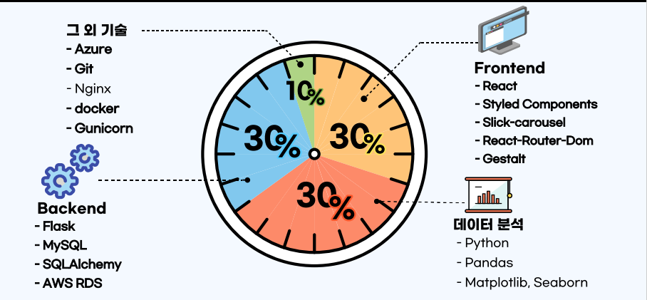

# (배달구구)
- 엘리스 배달 웹 서비스 배달 구구입니다.

## 1. 프로젝트 소개
- 사용 기술
  - 

- 날씨와 요일, 시간을 통해 메뉴 선택을 도와주는 프로젝트입니다.

## 2. 프로젝트 목표
- 배달품목의 다양성으로 메뉴 선택에 곤란한 사람들에게 선택지를 주고자 시작한 프로젝트입니다.

## 3. 프로젝트 기능 설명
- 날짜, 시간, 요일에 따른 추천 메뉴
- 인스타그램 데이터를 통한 실제 상황에 밀접한 데이터 분석을 수행하였습니다.

## 4. 프로젝트 구성도
[Project-Figma](https://www.figma.com/file/keWrEQpfXP0qIBwSD2JJOl/%EB%B0%B0%EB%8B%AC?node-id=3%3A10)

[Project-구성](img/2022-01-10-17-09-01.png)

## 5. 프로젝트 팀원 역할 분담
| 이름 | 담당 업무 |
| ------ | ------ |
| 이수진 | 팀장/백엔드 개발, API 개발, 스크럼 주관 및 발표 준비|
| 노영훈 | 백엔드 개발, 서버 배포, git-lab 관리, 발표|
| 홍준형 | 프론트엔드 개발, 와이어프레임, 데이터 수집, 프론트엔드 API 개발|
| 박진호 | 프론트엔드 개발|
| 현소영 | 가설 설정, 데이터 분석 인사이트 도출|

**멤버별 responsibility**

1. 팀장

- 기획 단계: 구체적인 설계와 지표에 따른 프로젝트 제안서 작성
- 개발 단계: 팀원간의 일정 등 조율 + 백엔드
- 수정 단계: 스크럼 진행, 발표 준비

2. 프론트엔드

- 기획 단계: 큰 주제에서 문제 해결 아이디어 도출, 와이어프레임 작성
- 개발 단계: 와이어프레임을 기반으로 구현
- 수정 단계: 코치님 피드백 반영해서 프론트 디자인 수정

3. 백엔드

- 기획 단계: 데이터셋을 확보하기 위한 데이터베이스 구축, 데이터셋 수집
- 개발 단계: 데이터 베이스 구축 및 API 활용, 웹서비스 사용자의 정보 수집 기능 구현, 인공지능 학습 결과를 활용한 기능 구현
- 수정 단계: 코치님 피드백 반영해서 백엔드 설계/기능 수정

4. 데이터 분석
- 기획 단계: 사용할 데이터 셋에 대한 선택 및 가설 설정
- 개발 단계: 수집된 데이터 셋을 통한 데이터 분석
- 수정 단계: 코치님 피드백 반영해서 백엔드 설계/기능 수정

## 6. 버전
  - 3.7

